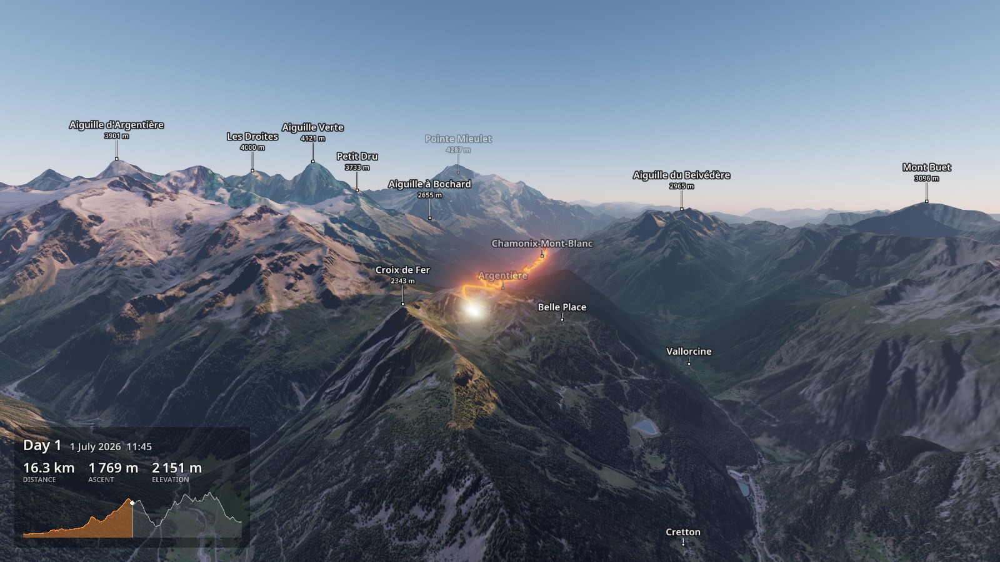
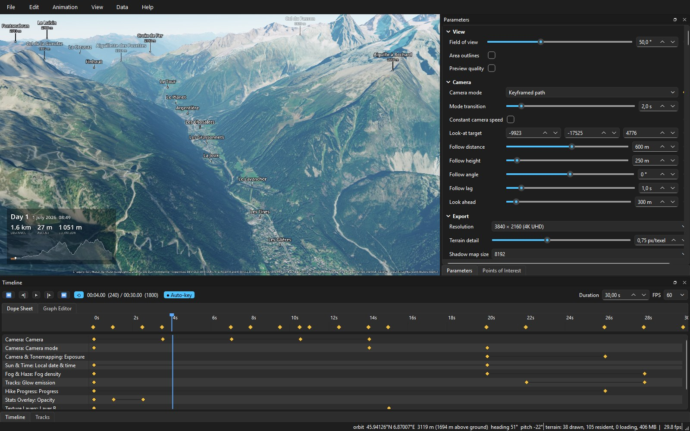
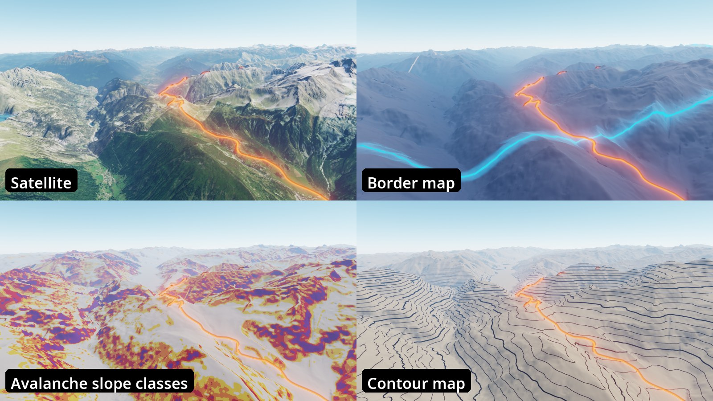
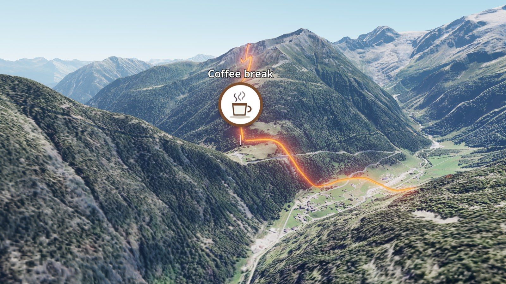
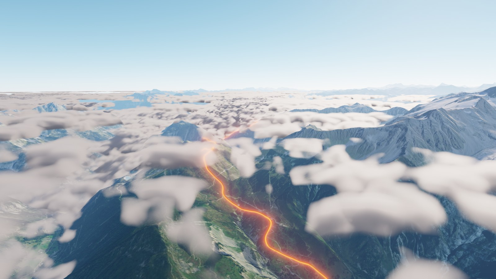
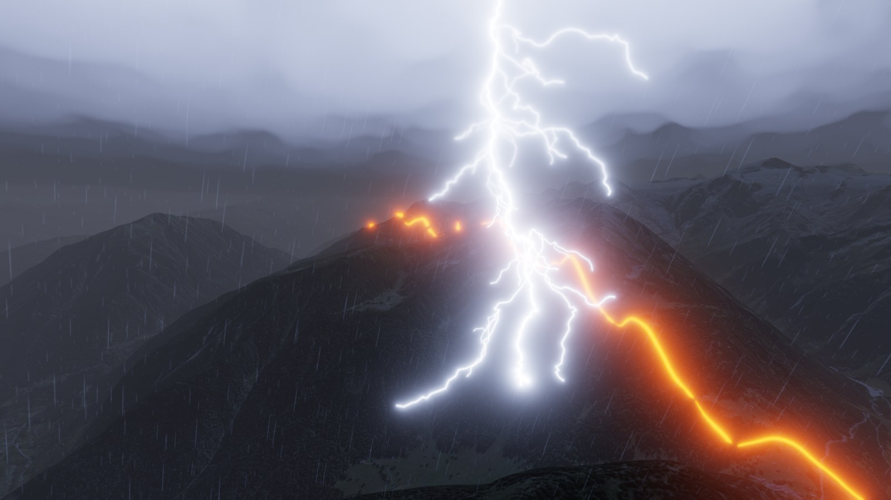
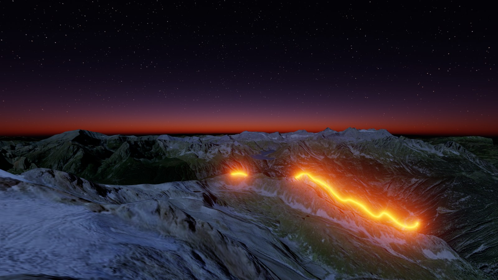
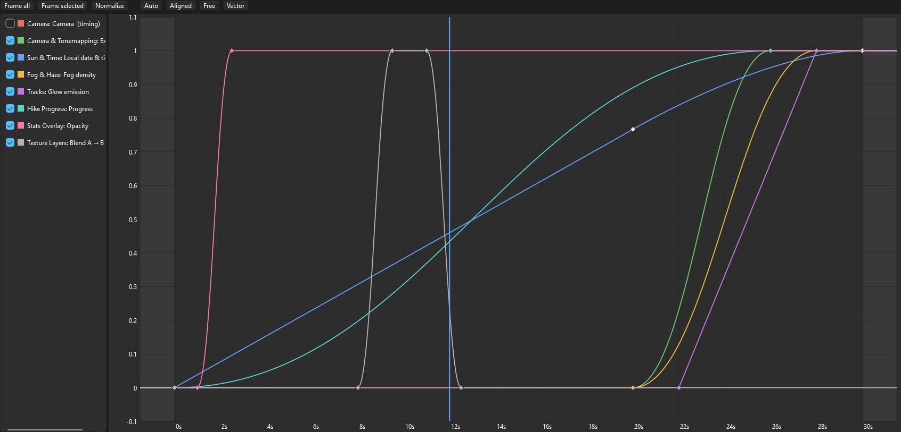

# Earthling

Cinematic 3D flyover videos of your hikes. Load GPX files, download satellite imagery and
elevation data, render the terrain with OpenGL shaders, animate everything on a keyframe
timeline and export 4K video.



## What it does

- **Real terrain, anywhere:** worldwide imagery and elevation (Esri World Imagery, Copernicus
  DEM), plus high-resolution national data built in for France (IGN) and Switzerland
  (swisstopo). You can add more regions in the project configuration.
- **Only what you need:** the downloads follow your tracks, with detail zones (for example
  the finest imagery within 1 km of the route, and coarse data 25 km out).
- **Physically based sky:** atmosphere with aerial perspective, sun position from date, time and
  place (or from the GPX timestamps), shadows, a night sky with stars.
- **Tracks that tell the story:** a progress head that follows the hike through time or
  distance, glow, casing, dashes for planned routes, and track groups with their own styles
  (for example "walked" and "official route").
- **Overlays:** peak, pass and place labels (OpenStreetMap), a stats panel with distance,
  ascent, elevation profile and time of day (in English or German), and data attribution.
- **Points of interest:** icons (PNG, animated GIF or APNG, sprite sheets) with captions,
  pop-in animations and effects.
- **Weather:** volumetric fog and cloud layers with shadows, rain with wet ground and reduced
  visibility, and thunderstorms with lightning.
- **Texture layers:** satellite, topographic map, a border map with glowing country borders,
  slope classes, aspect, elevation, contour lines and hillshade. Crossfade between any two.
- **Keyframe everything:** camera paths, sun, weather, layers and overlays on a timeline with
  a dope sheet and graph editor, undo/redo and auto-key. Scenes are saved as JSON.
- **Video export:** H.264, H.265, ProRes 4444 and DNxHR, up to 4K, with anti-aliasing and
  motion blur. From the GUI or the command line.



## Gallery

| | |
|---|---|
|  |  |
| **Texture layers:** satellite, border map, avalanche slope classes, contour map | **Points of interest:** animated icons with captions and effects |
|  |  |
| **Weather:** fog banks and cloud layers with shadows | **Thunderstorms:** rain, branching lightning and flashes lighting up the scene |
|  |  |
| **Dusk and night:** afterglow, stars and a glowing track | **Graph editor:** eased keyframe curves for every animated property |

The pictures come from the demo project in [examples/alps_demo](examples/alps_demo), two
synthetic days on the Tour du Mont Blanc. [tools/make_readme_images.py](tools/make_readme_images.py)
renders them again.

## Quick start

```powershell
python -m pip install --user uv   # if uv is not installed
uv sync
uv run earthling fetch examples/alps_demo   # download imagery, elevation and labels
uv run earthling gui examples/alps_demo     # open the demo in the application
```

Earthling needs Python 3.12 and a GPU with OpenGL 4.3.

## Your own project

A project is a folder with your GPX files and an `earthling.toml`:

```toml
[project]
gpx_dir   = "gpx/"
cache_dir = "~/earthling-cache"   # shared between projects
timezone  = "Europe/Paris"

[area]
border_km = 8.0
zones = [   # finer data close to the tracks
  { within_km = 1.5, imagery_zoom = 16, dem_zoom = 13 },
  { within_km = 4.0, imagery_zoom = 15, dem_zoom = 12 },
  { within_km = 8.0, imagery_zoom = 13, dem_zoom = 11 },
]

[sources]   # in priority order; regional sources only where they have data
imagery = ["ign_bdortho", "swisstopo_swissimage", "esri_world_imagery"]
dem     = ["ign_rgealti", "swisstopo_alti3d", "copernicus_glo30"]
```

Several track groups can have their own detail zones and styles. For example, your walked days
can get full detail while a 3000 km planned route gets a coarse overview (`[[tracks]]`, see
[ROADMAP.md](ROADMAP.md), phase 14).

## Command line

```powershell
uv run earthling plan   <project>             # tiles and download size per zone and source
uv run earthling fetch  <project>             # download everything into the cache
uv run earthling render <project> --scene scene.json --preset h264 --resolution 3840x2160
uv run earthling render --list-presets
uv run earthling check-source <project> ign_bdortho --out contact-sheet/   # test a source
```

## Data sources

| Kind | Worldwide | Regional (built in) |
|---|---|---|
| Imagery | Esri World Imagery, EOX Sentinel-2 cloudless | IGN BD ORTHO (France), swisstopo SWISSIMAGE (Switzerland) |
| Elevation | Copernicus DEM GLO-30, AWS Terrain Tiles | IGN RGE ALTI (France), swisstopo swissALTI3D (Switzerland) |
| Maps and labels | OpenTopoMap, OpenStreetMap (Overpass), Natural Earth borders | |

Please respect the terms of use of each provider. The attribution shows up in the stats
overlay. To add a region, see [docs/adding-a-region.md](docs/adding-a-region.md).

## Development

```powershell
uv run pytest
uv run ruff check
```

[ROADMAP.md](ROADMAP.md) documents the architecture and every implemented step.
